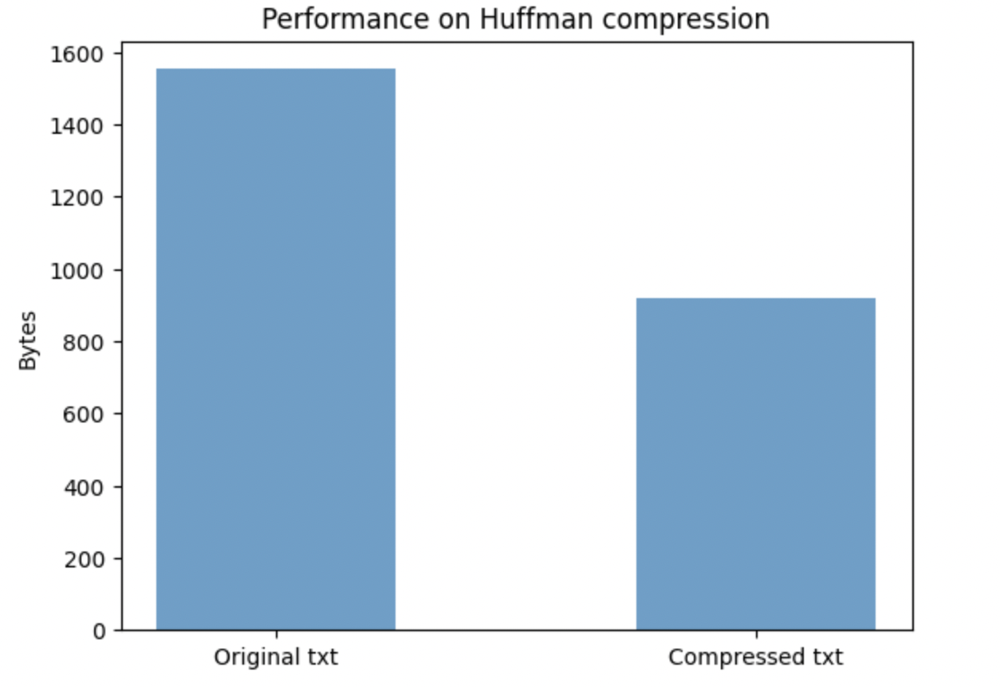

# Huffman Coding Based File Compression Tool

## Introduction
Compression software has been used more and more frequently in our daily lives. However, few people knows how compression software works to help us compress the files and save the memory.In this program, we implement the huffman algorithm in C++ which could help you learn and understand the secrets behind compression/decompression. Without losing any bits in the original files, huffman algorithm is a strong and efficient way to compress/decompress files. We will explain the methodology behind this project below.

## Implementation Details
In this project, we strictly follow the huffman algorithm. Below are the procedures for compressing and decompressing. Please check Encoding.cpp and Decoding.cpp if you have any questions for the inner work of huffman algorithm.

### Compression
- Read the input files and generate the frequency table for each characters.
- Build the huffman tree by using priority queue.
- Using the huffman tree to genrate a hash map where key is the character in input file and value is the huffman code.
- Put header which contain the compressed huffman tree to the output file.
- Read one bit step by step and transfrom it into huffman-code we generated.

### Decompression
- Read the header from the file we wanna decompressed, and generate the huffman tree from it.
- Read one byte step by step and decompressed the whole files.

### How to run?
Download encoding.cpp,encoding.h and decoding.cpp. Then choose the file you want to compress/decompress and run encoding and decoding. Hope you guys will enjoy it! If you find any questions/bugs, please contact me via yaozl2000@163.com.

## Performance

